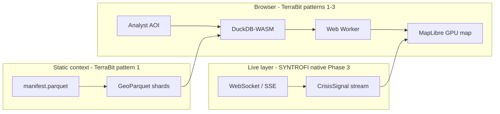

# Why SYNTROFI Borrows Three Patterns from TerraBit

**Audience:** technical reviewers  
**Product:** SYNTROFI (NRC Clear · Crisis Intelligence)  
**Upstream reference:** [blessedux/terrabit](https://github.com/blessedux/terrabit)

---

## Executive summary

SYNTROFI is **not** a fork of TerraBit’s product. TerraBit is a satellite **visual similarity search** demo. SYNTROFI is a **humanitarian crisis intelligence map**.

We adopt **three architectural patterns** from TerraBit because they solve the same hard problem both products face: **make large geospatial datasets feel instant in the browser, without a heavy backend on every map interaction.**

Everything else in the TerraBit repo — embeddings, Hamming search, exemplar UI, global Sentinel chip index — is intentionally **out of scope**.

---

## The three features we take (and only these)


| #     | TerraBit pattern                   | SYNTROFI module     | What it does                                                                                    |
| ----- | ---------------------------------- | ------------------- | ----------------------------------------------------------------------------------------------- |
| **1** | **Manifest + shard pruning**       | `db.ts`, `scripts/` | Load only GeoParquet shards that intersect the analyst’s AOI — never the full country or globe. |
| **2** | **MapLibre operational map shell** | `map.ts`, `main.ts` | GPU-rendered basemap, province presets, rectangle/polygon AOI drawing, layer toggles.           |
| **3** | **Web Worker compute pipeline**    | `scoring-worker.ts` | Rank, cluster, and aggregate off the main thread so the map stays responsive under load.        |


**You are right:** it is effectively **three features**, not “the whole repo.”

---

## Why this is a huge win for SYNTROFI

Traditional crisis/GIS dashboards tend to be slow because they:

- Hit a **backend API on every pan, zoom, or filter**
- Ship **large GeoJSON** blobs to the browser
- Mix **static context layers** (population, roads) with **live events** in one pipeline
- Render thousands of **DOM markers** instead of GPU layers

SYNTROFI’s TerraBit-inspired architecture inverts that:

```
Analyst draws AOI
    → manifest prunes shards by bbox (server: zero compute)
    → browser fetches 2–12 shard files (not 40–60 national shards)
    → DuckDB-WASM filters + joins locally
    → Web Worker ranks/clusters
    → MapLibre renders on GPU
Live crisis events (Phase 3+) arrive via WebSocket — separate from static shards
```

**Separation of concerns:**


| Data type                                         | Storage                                | How it moves                            |
| ------------------------------------------------- | -------------------------------------- | --------------------------------------- |
| Slow-changing context (population, health, admin) | GeoParquet / PMTiles on object storage | Fetched once per AOI, cached in browser |
| Live crisis signals                               | PostGIS / Supabase (Phase 3)           | WebSocket/SSE stream                    |
| Map rendering                                     | MapLibre + (later) deck.gl             | GPU, no per-feature DOM                 |


That split is what makes SYNTROFI an **operational surface**, not a BI dashboard.

---

## Performance: how much better, and why

> **Note:** SYNTROFI is in Phase 1–2 with stub JSON shards. The numbers below are **architectural expectations** derived from TerraBit’s proven design and our Afghanistan sharding plan — not yet benchmarked on production GeoParquet. We will measure before Phase 3 launch.

### 1. Data transfer (manifest pruning)

**Without pruning:** load all Afghanistan context layers upfront.  
At planned ~~0.5° tiling, that is **~~40–60 shards per layer** × multiple layers.

**With pruning (TerraBit pattern):** a Kabul or Herat AOI typically intersects **~2–8 shards per layer**.


| Scenario            | Shards fetched (order of magnitude) | Reduction                  |
| ------------------- | ----------------------------------- | -------------------------- |
| National load       | 40–60 per layer                     | baseline                   |
| Province / city AOI | 2–8 per layer                       | **~85–95% fewer requests** |
| Small polygon AOI   | 1–3 per layer                       | **~95–98% fewer requests** |


For population grids (WorldPop-class data), the difference is not marginal — it is the difference between **hundreds of MB** and **a few MB** per query.

### 2. Backend load (browser-side DuckDB-WASM)

**Traditional:** each filter change → API round-trip → PostGIS query → GeoJSON response.

**SYNTROFI:** first fetch of shards for an AOI; subsequent filters (population threshold, vulnerability, layer toggle) run **in-browser** on data already loaded.


| Interaction                     | Backend queries                                  |
| ------------------------------- | ------------------------------------------------ |
| Pan/zoom inside same AOI        | **0** (reuse loaded shards)                      |
| Change filter slider            | **0**                                            |
| Draw new AOI                    | **0 compute** — static file GETs only            |
| New live crisis event (Phase 3) | **1 lightweight push** — not a full layer reload |


Expect **near-elimination of server-side spatial queries** for static context during an analyst session.

### 3. UI responsiveness (Web Workers)

TerraBit runs Hamming scoring on millions of candidates in a worker. SYNTROFI reuses the same threading model for:

- urgency / vulnerability ranking
- deduplication and clustering (Phase 3+)
- mesh aggregation before deck.gl render (Phase 4)

**Main thread stays free for map interaction.** Target: **60 fps map** even while recomputing rankings over **10k+ features** in the worker. Without workers, the same work would cause **multi-second UI freezes** — unacceptable for crisis ops.

### 4. Summary table


| Metric                           | Typical GIS dashboard    | SYNTROFI (TerraBit patterns)   |
| -------------------------------- | ------------------------ | ------------------------------ |
| Data fetched per query           | Full layer or large bbox | AOI-intersecting shards only   |
| API calls per pan/zoom           | 1+                       | 0 (static layers)              |
| Filter latency                   | 200ms–2s (network + DB)  | ~10–50ms (local columnar scan) |
| Main thread during heavy compute | Blocked                  | Offloaded to worker            |


---

## Why this is useful for humanitarian analysts

Analysts need to answer **fast, spatial questions** under pressure:

- *Where is population density highest inside this displacement corridor?*
- *Which health facilities fall inside this flood polygon?*
- *What changed in the last 6 hours — and is it verified?*

TerraBit’s patterns help because they optimize for **region-first thinking**:

1. **Draw or select a province** → only that region’s data loads.
2. **Filter locally** → no waiting on a server for every slider move.
3. **Map stays interactive** → ranking and clustering never freeze the UI.

That matches how NGO analysts actually work: **AOI → context → signal → decision**, not “load the whole country and hunt.”

---

## How SYNTROFI uses each pattern

### Pattern 1 — Manifest + shard pruning (`db.ts`)

```
manifest.json / manifest.parquet
  └── each row: { path, xmin, ymin, xmax, ymax, layer, row_count, updated_at }

Analyst AOI (bbox or polygon)
  └── ST_Intersects(AOI, shard_bbox)  →  list of shard URLs
  └── fetch only those shards (concurrent, limit 8)
  └── DuckDB-WASM: spatial filter + columnar queries on GeoParquet
  └── IndexedDB cache (key: path + updated_at)
```

**Afghanistan build pipeline** (`scripts/`): HDX, WorldPop, OSM → GeoParquet shards → manifest. Same ETL shape as TerraBit, different datasets.

### Pattern 2 — MapLibre shell (`map.ts`)

- Afghanistan-centered camera and bounds
- OpenFreeMap vector basemap + admin lines
- Shift-drag rectangle / polygon AOI tools
- GeoJSON overlay sources per humanitarian layer
- Province presets (Kabul, Herat, Kandahar, …)

MapLibre handles **pixels on GPU**. It does not query data — that is DuckDB’s job.

### Pattern 3 — Web Worker pipeline (`scoring-worker.ts`)

TerraBit used workers for Hamming distance on embeddings. SYNTROFI keeps the **message protocol and lifecycle** (init → requestId → result) and swaps the math:


| TerraBit worker                             | SYNTROFI worker (now / planned)                  |
| ------------------------------------------- | ------------------------------------------------ |
| Hamming vs exemplars                        | `vulnerability × population` ranking             |
| Outlier / surprise / gradient on embeddings | Crisis dedupe, clustering, mesh bins (Phase 3–4) |


Same performance property: **compute scales without blocking the map.**

---

## What we are deliberately NOT taking from TerraBit


| TerraBit feature                                | Why we skip it                                                                       |
| ----------------------------------------------- | ------------------------------------------------------------------------------------ |
| Clay v1.5 binary embeddings                     | Humanitarian signals are structured events, not visual similarity of satellite chips |
| Hamming / exemplar search UI                    | Wrong interaction model for crisis verification                                      |
| Global ~5M chip index                           | SYNTROFI is region-first (Afghanistan → expandable), not globe-wide visual retrieval |
| Sentinel chip data model                        | Replaced by `CrisisSignal` + static humanitarian layers                              |
| Satellite similarity view modes as core product | Deferred; deck.gl heatmaps/hexbins serve a different analyst need                    |


**TerraBit proves the browser can do serious geospatial work.**  
**SYNTROFI applies that proof to humanitarian operations** — not to finding “patches that look like this field.”

---

## Architecture at a glance




---

## Reviewer checklist

- [x] We borrow **three patterns**, not the TerraBit product
- [x] Performance win is **orders-of-magnitude less data per AOI**, not magic — bounded by shard design
- [x] Static layers and live signals stay **separate pipelines**
- [x] Browser does filtering; backend does ingestion and push — **not per-zoom queries**
- [ ] Production benchmarks on real GeoParquet — **before Phase 3 sign-off**

---

## References

- TerraBit upstream: [https://github.com/blessedux/terrabit](https://github.com/blessedux/terrabit)  
- SYNTROFI implementation: `src/db.ts`, `src/map.ts`, `src/scoring-worker.ts`, `scripts/`  
- Product spec: live `CrisisSignal` stream, deck.gl mesh, analyst verification — Phases 3–5

